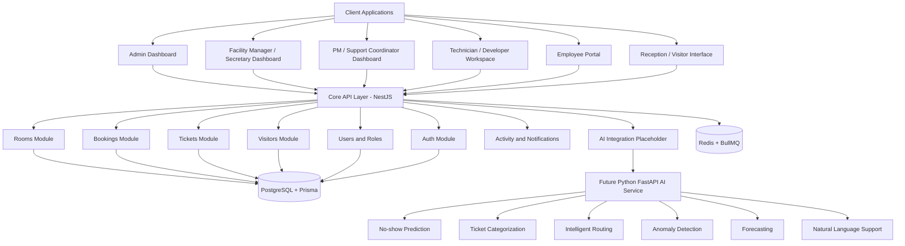
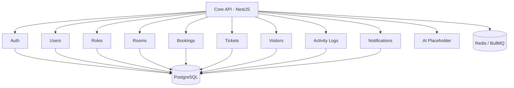
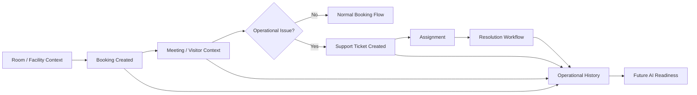
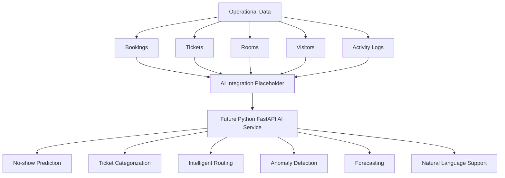

# AI-Powered Smart Facility & Support Operations System


This repository contains the technical foundation for a Smart Facility & Support Operations System.

The platform is intended to support:
- facility and boardroom booking
- support ticketing and service workflows
- visitor and meeting operations
- future AI-assisted intelligence

## 1. Project Summary

The system is designed to improve how organizations manage workplace operations through structured digital workflows.

It covers four main operational areas:
- facility operations
- support operations
- visitor workflows
- AI-assisted operational intelligence

This project is being prepared as a strong technical foundation that can support future expansion into additional SaaS services.

## 2. Core Product Areas

### 2.1 Facility Operations
This area supports:
- room and boardroom booking
- room availability tracking
- booking status workflows
- meeting and scheduling context
- visitor readiness
- future room utilization and no-show intelligence

### 2.2 Support Operations
This area supports:
- ticket creation
- issue categorization
- assignment and reassignment
- escalation readiness
- resolution workflows
- operational accountability and support visibility

### 2.3 Visitor Workflows
This area supports:
- visitor records
- host-linked visitor context
- booking-linked meeting context
- reception workflow readiness

### 2.4 AI-Assisted Intelligence
Planned capabilities include:
- no-show prediction
- ticket categorization
- intelligent routing
- anomaly detection
- forecasting
- natural language support

## 3. Technology Stack

### 3.1 Backend
- NestJS
- TypeScript
- PostgreSQL
- Prisma
- BullMQ + Redis
- JWT Authentication

### 3.2 Frontend
- React
- Vite
- TypeScript
- Tailwind CSS
- Framer Motion

### 3.3 AI Layer
- Python FastAPI
- future support for prediction, categorization, routing, anomaly detection, forecasting, and natural language support

## 4. System Architecture Overview



## 5. Operational Domains

### 5.1 Facility Domain
Responsible for:
- rooms
- bookings
- scheduling
- facility context
- visitor readiness

### 5.2 Support Domain
Responsible for:
- incidents
- service requests
- tickets
- assignment
- escalation
- resolution workflows

### 5.3 Connected Context
The platform is designed so that:
- a booking can later generate a support ticket
- a ticket can reference a room
- a ticket can reference a booking
- a visitor can later relate to a booking or support workflow
- repeated room incidents can be analyzed over time

## 6. Backend Foundation

The backend foundation is the first major delivery target.

### 6.1 Core Modules
- auth
- users
- roles / permission readiness
- rooms
- bookings
- tickets
- visitors
- activity logs
- notifications
- ai integration placeholder

### 6.2 Core Entities
- user
- room
- booking
- ticket
- visitor

### 6.3 Supported Roles
- ADMIN
- PM
- SECRETARY
- TEAM_LEAD
- DEVELOPER
- TECHNICIAN
- CLIENT

## 7. Backend Structure

```text
server/
  src/
    auth/
    users/
    roles/
    rooms/
    bookings/
    tickets/
    visitors/
    activity/
    notifications/
    ai/
    common/
      decorators/
      dto/
      enums/
      filters/
      guards/
      interceptors/
      pipes/
      utils/
    config/
    prisma/
    app.module.ts
    main.ts
  prisma/
    schema.prisma
  .env
  .gitignore
  package.json
  tsconfig.json
```

## 8. Backend Module Layout



## 9. Data and Workflow Flow



## 10. Planned Entity Direction

### 10.1 User
- name
- email
- password
- role
- isActive

### 10.2 Room
- name
- location
- capacity
- description
- isActive

### 10.3 Booking
- title / purpose
- room
- createdBy
- date
- startTime
- endTime
- status
- notes

### 10.4 Ticket
- title
- description
- category
- priority
- status
- createdBy
- assignedTo
- bookingId
- roomId
- visitorId

### 10.5 Visitor
- name
- host
- booking
- check-in context

## 11. AI Readiness

The backend is expected to capture structured operational data from day one so future AI services can plug in without major rework.

Data that should be captured early:
- booking creation and updates
- booking outcomes and status history
- room usage patterns
- ticket categories and priorities
- ticket state changes
- ticket-room linkage
- ticket-booking linkage
- visitor check-in events
- user assignment history
- repeated room issues



## 12. Development Roadmap

### 12.1 V1 — Foundation
- NestJS project structure
- PostgreSQL + Prisma setup
- authentication foundation
- users and roles foundation
- rooms module
- bookings module
- tickets module
- placeholder modules for visitors, activity, notifications, and AI integration
- validation, error handling, and configuration readiness

### 12.2 V2 — Operational Workflows
- booking approvals
- conflict detection
- ticket assignment and reassignment
- ticket comments
- stronger authorization
- notifications
- activity logs
- contextual linking across core modules

### 12.3 V3 — Intelligence and Admin Maturity
- AI integration endpoints and hooks
- analytics and insights support
- richer permissions
- audit logs
- operational anomaly and trend support
- stronger admin controls

## 13. API Direction

Planned route groups:
- /auth
- /users
- /roles
- /rooms
- /bookings
- /tickets
- /visitors
- /activity
- /notifications
- /ai

## 14. Repository Purpose

This repository is intended to serve as the official technical foundation for the project.

It should remain:
- clean
- structured
- team-friendly
- backend-first
- extensible
- ready for serious product growth

## 15. Current Status

- product direction clarified
- backend stack selected
- backend foundation structure defined
- AI-readiness included in architecture
- ready for backend foundation implementation

## 16. Author

Salat Caleb Kipkemoi  
Full-Stack Developer | Machine Learning Engineer  
ckipkemoi99@gmail.com  
+254 727 845 605
