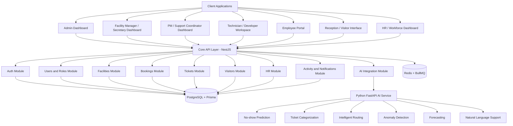
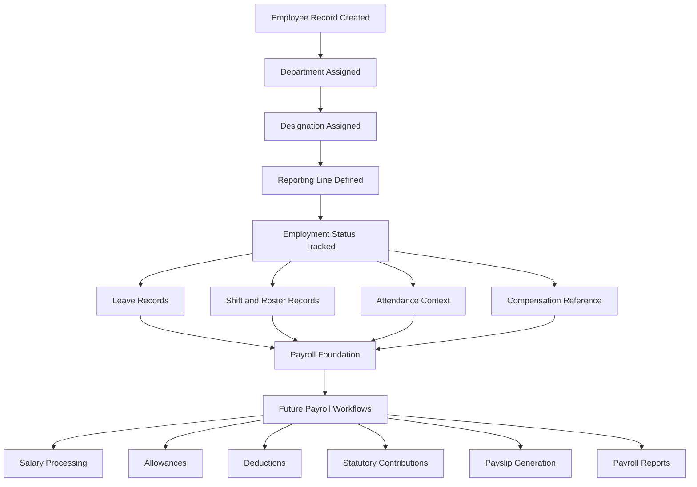
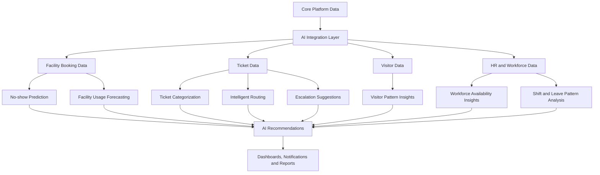

# AI-Powered Smart Facility & Support Operations System

A smart operations platform for managing facilities, support workflows, visitors, HR operations, and AI-assisted intelligence.

The system is designed as a scalable foundation for workplace operations and future SaaS expansion.

## Core Operational Areas

- Facility operations
- Support ticketing
- Visitor workflows
- HR and workforce operations
- AI-assisted intelligence

## Product Scope

### Facility Operations

- Room bookings
- Booking approvals
- Availability tracking
- Meeting readiness
- Facility utilization
- No-show tracking
- Future forecasting

### Support Operations

- Ticket creation
- Issue categorization
- Ticket assignment
- Reassignment
- Escalation
- Progress tracking
- Resolution
- Accountability

### Visitor Workflows

- Visitor records
- Check-in
- Check-out
- Host linking
- Reception flow
- Arrival alerts
- Visit history

### HR & Workforce Operations

- Employee records
- Departments
- Teams
- Roles
- Reporting lines
- Leave management
- Shifts
- Rosters
- Onboarding
- Offboarding

### Payroll Foundation

- Payroll profiles
- Compensation references
- Attendance context
- Leave records
- Audit readiness

Full payroll workflows will come later.

Future payroll scope:

- Payroll processing
- Payslip generation
- Statutory deductions
- Tax handling
- Payroll approvals

### AI-Assisted Intelligence

- No-show prediction
- Ticket categorization
- Intelligent routing
- Anomaly detection
- Forecasting
- Workforce insights
- Natural language support
- Operational recommendations

The AI layer will run as a separate intelligence service connected to the core platform.

## Technology Stack

### Backend

- NestJS
- TypeScript
- PostgreSQL
- Prisma ORM
- JWT Authentication
- Redis
- BullMQ

### Frontend

- React
- Vite
- TypeScript
- Tailwind CSS
- Framer Motion

### AI Service

- Python
- FastAPI
- Machine Learning APIs
- Prediction APIs
- Classification APIs
- Forecasting APIs
- Natural Language APIs

## System Architecture Overview

## Operational Flow Overview

```mermaid
flowchart TD
    A[User Logs In] --> B[Role-Based Access Control]

    B --> C[Admin]
    B --> D[Facility Manager / Secretary]
    B --> E[Support Coordinator / PM]
    B --> F[Technician / Developer]
    B --> G[Employee]
    B --> H[Reception]
    B --> I[HR Officer]

    C --> C1[Manage Users, Roles, Facilities, Tickets, HR, Visitors and Reports]

    D --> D1[Manage Facilities]
    D --> D2[Approve or Reject Bookings]
    D --> D3[Track Facility Usage]

    E --> E1[Review Tickets]
    E --> E2[Assign Tickets]
    E --> E3[Escalate Issues]
    E --> E4[Monitor Resolution Progress]

    F --> F1[Receive Assigned Tickets]
    F --> F2[Update Progress]
    F --> F3[Resolve Issues]

    G --> G1[Book Facilities]
    G --> G2[Create Tickets]
    G --> G3[Request Leave]
    G --> G4[View Activity]

    H --> H1[Register Visitors]
    H --> H2[Link Visitor to Host]
    H --> H3[Confirm Meeting Context]
    H --> H4[Notify Host]

    I --> I1[Manage Employees]
    I --> I2[Manage Departments and Teams]
    I --> I3[Track Leave and Availability]
    I --> I4[Prepare Payroll Foundation]
```

## HR and Payroll Foundation Flow

## AI Layer Flow

## Core Modules

- Auth
- Users
- Roles and Permissions
- Facilities
- Bookings
- Tickets
- Visitors
- HR
- Departments
- Teams
- Leave
- Shifts and Rosters
- Notifications
- Activity Logs
- Reports
- AI Integration

## User Roles

- Super Admin
- Admin
- Facility Manager
- Secretary
- Support Coordinator
- Project Manager
- Team Lead
- Technician
- Developer
- HR Officer
- Employee
- Receptionist

Access is controlled through role-based permissions.

## Authentication

Planned authentication features:

- Registration
- Login
- JWT authentication
- Password hashing
- Protected routes
- User status control
- Role-based access
- Future OTP verification
- Future Google Sign-In

## Database Foundation

Main entities may include:

- User
- Role
- Permission
- Department
- Team
- EmployeeProfile
- Facility
- Booking
- Ticket
- TicketCategory
- TicketAssignment
- Visitor
- LeaveRequest
- Shift
- DutyRoster
- Notification
- ActivityLog
- AIInsight
- PayrollProfile
- CompensationReference

The database should support future expansion without breaking existing modules.

## Payroll Readiness

Payroll is not fully implemented in the foundation stage.

The system prepares for payroll through:

- Employee payroll profiles
- Employment types
- Compensation references
- Basic salary references
- Allowance readiness
- Deduction readiness
- Statutory contribution readiness
- Leave and attendance context
- Payroll status
- Payroll notes
- HR and payroll audit logs

## Reporting Readiness

Future reports may include:

- Facility booking reports
- Facility utilization reports
- Ticket resolution reports
- Escalation reports
- Visitor reports
- HR reports
- Leave reports
- Shift reports
- Payroll readiness reports
- AI prediction reports
- Operational dashboards

## Development Focus

Current focus:

- Clean backend architecture
- Scalable database design
- Role-based access control
- Facility operations
- Support ticketing
- Visitor workflows
- HR foundation
- Payroll readiness
- AI integration readiness
- Future SaaS expansion

## Future Expansion

Planned future features:

- Full payroll workflows
- Advanced HR automation
- Visitor self-check-in
- Calendar integrations
- Email and SMS notifications
- AI assistant features
- Voice and natural language commands
- Meeting automation
- Facility recommendations
- SLA tracking
- Advanced analytics
- Multi-tenant SaaS support
- Mobile apps

## Repository Purpose

This repository provides the foundation for a smart operations platform covering workplace management, support workflows, facility scheduling, workforce visibility, visitor coordination, and future AI automation.

## License

This project is proprietary.

All rights reserved.
